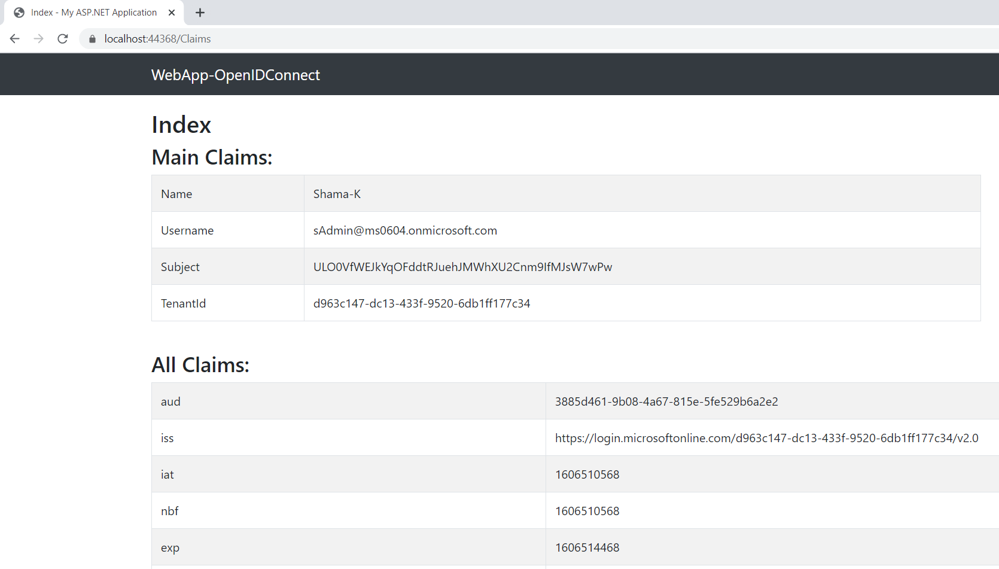

# Sign in a user in an ASP.NET Web App with OpenID Connect and the Microsoft identity platform

 1. [Overview](#overview)
 1. [Scenario](#scenario)
 1. [Contents](#contents)
 1. [Prerequisites](#prerequisites)
 1. [Setup](#setup)
 1. [Registration](#registration)
 1. [Running the sample](#running-the-sample)
 1. [Explore the sample](#explore-the-sample)
 1. [About the code](#about-the-code)
 1. [More information](#more-information)
 1. [Community Help and Support](#community-help-and-support)
 1. [Code of Conduct](#code-of-conduct)

## Overview

This sample demonstrates a ASP.NET web app application that authenticates users against Azure AD.

## Scenario

1. The client ASP.NET web app application uses the Microsoft Authentication Library (MSAL) to obtain an ID Token from **Azure AD**:
2. The **ID Token** proves that the user has successfully authenticated against **Azure AD**.

## Prerequisites

- [Visual Studio](https://visualstudio.microsoft.com/downloads/)
- An **Azure AD** tenant. For more information see: [How to get an Azure AD tenant](https://docs.microsoft.com/azure/active-directory/develop/quickstart-create-new-tenant)
- A user account in your **Azure AD** tenant.

## Setup

### Step 1: Clone or download this repository

From your shell or command line:

```console
git clone https://github.com/AzureADQuickStarts/AppModelv2-WebApp-OpenIDConnect-DotNet.git
cd AppModelv2-WebApp-OpenIDConnect-DotNet
```

or download and extract the repository .zip file.

> :warning: To avoid path length limitations on Windows, we recommend cloning into a directory near the root of your drive.

### Register the sample application(s) with your Azure Active Directory tenant

There is one project in this sample. To register it, you can:

- follow the steps below to manually register your apps
- or use PowerShell scripts that:
  - **automatically** create the Azure AD applications and related objects (passwords, permissions, dependencies) for you.
  - modify the projects' configuration files.

<details>
  <summary>Expand this section if you want to use this automation:</summary>

> :warning: If you have never used **Azure AD Powershell** before, we recommend you go through the [App Creation Scripts](./AppCreationScripts/AppCreationScripts.md) once to ensure that your environment is prepared correctly for this step.

1. On Windows, run PowerShell as **Administrator** and navigate to the root of the cloned directory
1. If you have never used Azure AD Powershell before, we recommend you go through the [App Creation Scripts](./AppCreationScripts/AppCreationScripts.md) once to ensure that your environment is prepared correctly for this step.
1. In PowerShell run:

   ```PowerShell
   Set-ExecutionPolicy -ExecutionPolicy RemoteSigned -Scope Process -Force
   ```

1. Run the script to create your Azure AD application and configure the code of the sample application accordingly.
1. In PowerShell run:

   ```PowerShell
   cd .\AppCreationScripts\
   .\Configure.ps1
   ```

   > Other ways of running the scripts are described in [App Creation Scripts](./AppCreationScripts/AppCreationScripts.md)
   > The scripts also provide a guide to automated application registration, configuration and removal which can help in your CI/CD scenarios.

</details>

### Choose the Azure AD tenant where you want to create your applications

As a first step you'll need to:

1. Sign in to the [Azure portal](https://portal.azure.com).
1. If your account is present in more than one Azure AD tenant, select your profile at the top right corner in the menu on top of the page, and then **switch directory** to change your portal session to the desired Azure AD tenant.

### Register the Web app (Quickstart-AspNetWebApp)

1. Navigate to the [Azure portal](https://portal.azure.com) and select the **Azure AD** service.
1. Select the **App Registrations** blade on the left, then select **New registration**.
1. In the **Register an application page** that appears, enter your application's registration information:
   - In the **Name** section, enter a meaningful application name that will be displayed to users of the app, for example `Quickstart-AspNetWebApp`.
   - Under **Supported account types**, select **Accounts in this organizational directory only**.
   - In the **Redirect URI (optional)** section, select **Web** in the combo-box and enter the following redirect URI: `https://localhost:44368/`.
     > Note that there are more than one redirect URIs used in this sample. You'll need to add them from the **Authentication** tab later after the app has been created successfully.
1. Select **Register** to create the application.
1. In the app's registration screen, find and note the **Application (client) ID**. You use this value in your app's configuration file(s) later in your code.
1. In the app's registration screen, select **Authentication** in the menu.
   - If you don't have a platform added, select **Add a platform** and select the **Web** option.
   - In the **Redirect URIs** section, enter the following redirect URIs.
      - `https://localhost:44368/signin-oidc`
   - In **Implicit grant** section, select the check box for **ID tokens**.
   - In the **Logout URL** section, set it to `https://localhost:44368/signout-oidc`.
1. Select **Save** to save your changes.

#### Configure the Web app (Quickstart-AspNetWebApp) to use your app registration

Open the project in your IDE (like Visual Studio or Visual Studio Code) to configure the code.

> In the steps below, "ClientID" is the same as "Application ID" or "AppId".

1. Open the `AppModelv2-WebApp-OpenIDConnect-DotNet\Web.config` file.
1. Find the key `ClientId` and replace the existing value with the application ID (clientId) of the `Quickstart-AspNetWebApp` application copied from the Azure portal.
1. Find the key `Tenant` and replace the existing value with your Azure AD tenant ID.

## Running the sample

> For Visual Studio Users
>
> Clean the solution, rebuild the solution, and run it.

## Explore the sample

1. Open your browser and navigate to `https://localhost:44368`.
1. Select the **Sign in** button on the top right corner. When the user signs-in for the first time , a consent screen is presented with required permissions, select **Accept**.

   Click on **See Your Claims** link, you will see claims from the signed-in user's token.



> :information_source: Did the sample not work for you as expected? Then please reach out to us using the [GitHub Issues](../../issues) page.

## We'd love your feedback!

Were we successful in addressing your learning objective? [Do consider taking a moment to share your experience with us.](https://forms.office.com/Pages/ResponsePage.aspx?id=v4j5cvGGr0GRqy180BHbR73pcsbpbxNJuZCMKN0lURpUMzVNNTNIWVU0VTdSMUc4WEdYWUwxQlFNVSQlQCN0PWcu)

## About the code

1. In `Startup.cs`, **Configuration** method configures OWIN to use OpenIdConnect as below:

    ```csharp
     public void Configuration(IAppBuilder app)
      {
            ...
            app.UseOpenIdConnectAuthentication(
            new OpenIdConnectAuthenticationOptions
            {
                ClientId = clientId,
                Authority = authority,
                RedirectUri = redirectUri,
                PostLogoutRedirectUri = redirectUri,
                Scope = OpenIdConnectScope.OpenIdProfile,
                ResponseType = OpenIdConnectResponseType.CodeIdToken,
                Notifications = new OpenIdConnectAuthenticationNotifications
                {
                    AuthenticationFailed = OnAuthenticationFailed
                }
            }
        );
      }
    ```

1. `HomeController.cs` contains **SignIn** and **SignOut** methods as following:

    ```csharp
    public class HomeController : Controller
    {
        ...
        public void SignIn()
        {
            if (!Request.IsAuthenticated)
            {
                HttpContext.GetOwinContext().Authentication.Challenge(
                    new AuthenticationProperties { RedirectUri = "/" },
                    OpenIdConnectAuthenticationDefaults.AuthenticationType);
            }
        }
        public void SignOut()
        {
            HttpContext.GetOwinContext().Authentication.SignOut(
                    OpenIdConnectAuthenticationDefaults.AuthenticationType,
                    CookieAuthenticationDefaults.AuthenticationType);
        }
    }
    ```

## More information

- [Microsoft identity platform (Azure Active Directory for developers)](https://docs.microsoft.com/azure/active-directory/develop/)
- [Overview of Microsoft Authentication Library (MSAL)](https://docs.microsoft.com/azure/active-directory/develop/msal-overview)
- [Quickstart: Register an application with the Microsoft identity platform (Preview)](https://docs.microsoft.com/azure/active-directory/develop/quickstart-register-app)
- [Understanding Azure AD application consent experiences](https://docs.microsoft.com/azure/active-directory/develop/application-consent-experience)

For more information about how OAuth 2.0 protocols work in this scenario and other scenarios, see [Authentication Scenarios for Azure AD](https://docs.microsoft.com/azure/active-directory/develop/authentication-flows-app-scenarios).

## Community Help and Support

Use [Stack Overflow](http://stackoverflow.com/questions/tagged/msal) to get support from the community.
Ask your questions on Stack Overflow first and browse existing issues to see if someone has asked your question before.
Make sure that your questions or comments are tagged with [`azure-active-directory` `azure-ad-b2c` `ms-identity` `adal` `msal`].

If you find a bug in the sample, raise the issue on [GitHub Issues](../../issues).

To provide feedback on or suggest features for Azure Active Directory, visit [User Voice page](https://feedback.azure.com/forums/169401-azure-active-directory).

## Code of Conduct

This project has adopted the [Microsoft Open Source Code of Conduct](https://opensource.microsoft.com/codeofconduct/). For more information, see the [Code of Conduct FAQ](https://opensource.microsoft.com/codeofconduct/faq/) or contact [opencode@microsoft.com](mailto:opencode@microsoft.com) with any additional questions or comments.
